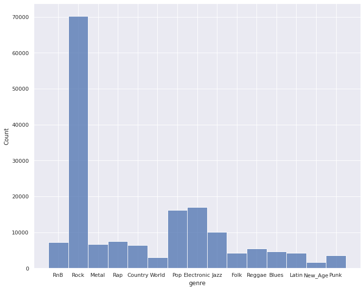
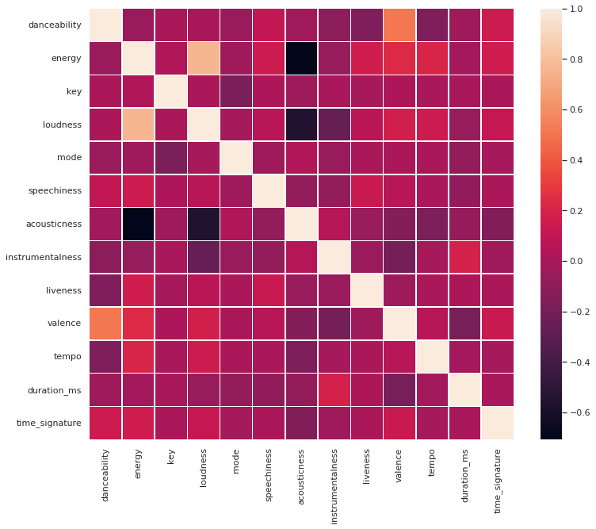
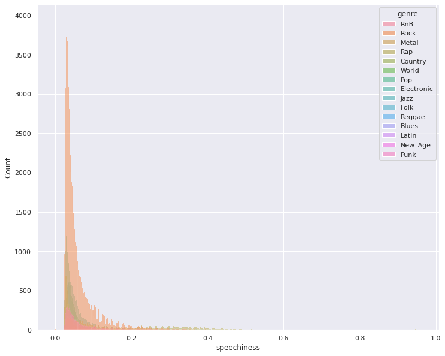
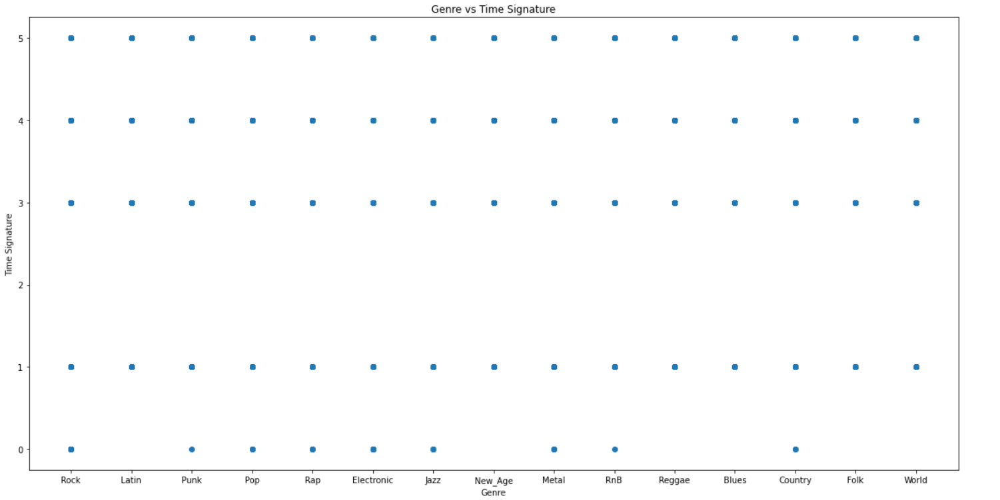
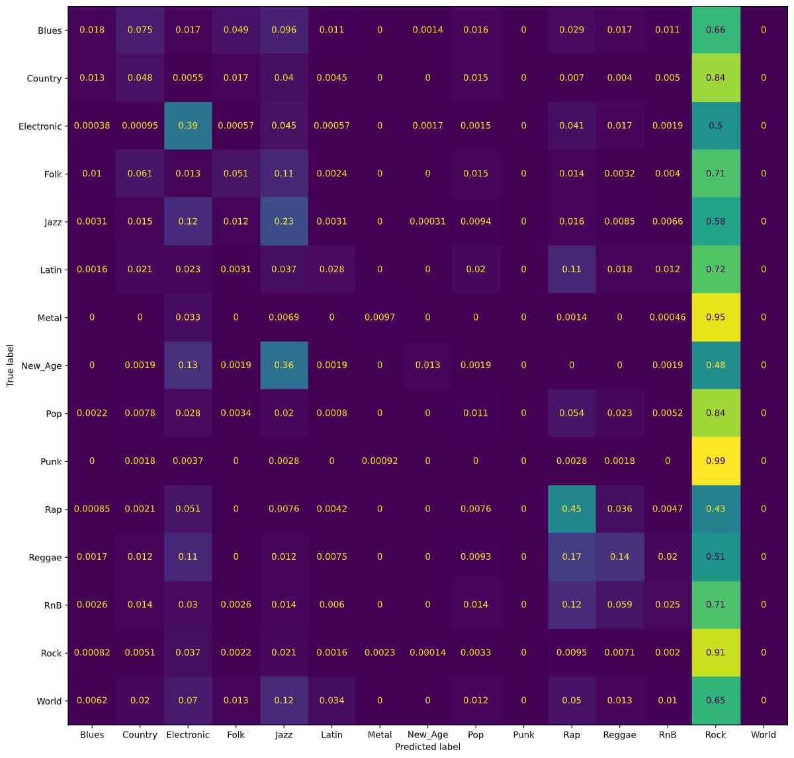

# Final Report
## Introduction
These days, we often hear the response _“I listen to everything except country”_ when asked about a favorite genre of music. We are currently witnessing the rise of “genre-less music fans” [[1]](#references), as online streaming services have greatly widened listeners’ tastes in music [[2]](#references). Exploring new genres is also beneficial, as research has shown that different genres have different abilities to provide relaxation, motivation, joy, and a stronger sense of self [[3]](#references). Many successful music recommendation systems are based on song genre [[4]](#references), but recommendations based on social features [[5]](#references) and lyrics [[6]](#references) have been shown to perform just as well as audio-based recommendations. With an increase in listeners of many genres, does a recommendation system focused mainly on audio truly reflect the listeners’ interests?  

## Problem Definition
We propose an approach where we use features that aren't strongly correlated to genre to predict music for users; this may include features such as lyrics and artist hotness. We call these features *genreless features*. With the increase in genreless music fans and the benefits of exploring new genres, we propose two models to assist in creating a song recommendation system:
1.	Classify the genre of the input song
2.	Recommend a new song with similar genreless features from a different genre

In completing these two goals, we can still provide a relevant recommendation while fostering the exploration of new genres.

## Dataset Collection
We first collected all 1,000,000 track IDs and song IDs from the [Million Song Dataset](http://millionsongdataset.com/) track_metadata.db file. From there, we were able to find the genre labels for 280,831 of these songs by using the [tagtraum annotation for the Million Song Dataset](https://www.tagtraum.com/msd_genre_datasets.html). We then removed the songs from our dataset that did not contain genre labels. 

To get the features for each song, we utilized the [Spotify API](https://developer.spotify.com/documentation/web-api/). First, we had to find the Spotify IDs that corresponded to the track IDs and song IDs that we collected from the Million Song Dataset. We were able to do this using [Acoustic Brainz Lab's Million Song Dataset Echo Nest mapping archive](https://labs.acousticbrainz.org/million-song-dataset-echonest-archive/). We were able to find corresponding Spotify IDs for 210,475 of our 280,831 datapoints. We then removed the songs which did not have a corresponding Spotify ID. 

Once we had the Spotify IDs for each song in our dataset, we were able to use the Spotify API to [retrieve the audio features](https://developer.spotify.com/documentation/web-api/reference/#/operations/get-audio-features) pertaining to each of our 210,475 songs. These features include:
- danceability
- energy
- key
- loudness
- mode
- speechiness
- acousticness
- instrumentalness
- liveness
- valence
- tempo
- duration_ms
- time_signature

## Dataset Exploration

### Distribution of Genres

 
As determined from our review of existing works on the MSD dataset and the associated Tagtraum dataset, there is a high degree of data imbalance that we will need to address for our models. We will explore metrics measuring model "goodness" that takes this into account (metrics such as accuracy may not be a good behavior of a model exploring deeper relationships in the data. There are 15 unique categories that we have as genre labels with about 42% comprising of the category "Rock". After the collection of our data, we retained 168,379 datapoints to train our models - losing points if not having an associated genre in the Tagtraum dataset or if not having a mapping from MSD Track ID to Spotify ID. The statistics presented throughout our exploration stage is on the 80 percent of data we use for training and cross validating (not the 20 percent held out for evaluation across models.

### Feature Histograms

 
From the various historgrams, we can see initial need for data preprossing given the differences in ranges of values from feature to feature and difference in overall distributions. 
### Feature Correlation Heat Map

 
The above image explores the correlation between the features in our dataset. Intuitively we can see some of these relationships. For instance, accousticness which describes songs with less electric amplication is negativelely correlated with loudness and energy. Similarly, we can see how valance (how "happy" a song is) and danceability are positively correlated, and loudness and energy are positively correlated.
### Features by Genre (Danceability and Speechiness)

 

 
The above image shows how early in our data exploration process, we see different features having different predictability capabilities (forms in its distribution by genre that can provide useful information). We can additionally see again our data is inherently skewed towards the genre "Rock." Finding ways to subsample datapoints of class Rock in our dataset is a method we hope to explore as a way to mitigate this issue.

Included below are scatter plots of some of the audio features vs the genre label.

## PCA and Dimensionality Reduction

The original dataset that we created using information from Spotify had 13 features as explained previously. All the columns/attributes were considered as features except the columns containing song/track ids and the genre column, which we used as our label. Since this was a large dataset with several features, we used Principal Component Analysis (PCA) to reduce the dimensionality of the dataset which would potentially make it easier to work with. We chose a threshold of 0.95 for the explained variance ratio to keep only the most important features. This helped us get a transformed dataset with 8 components.

The figure below shows the explained variance ratio of each of the PCA components.

#### Final update:
Also shown below is an interactive plot for PCA with 2 components. It shows the distribution of the data and gives us an idea of how the data is distributed. The clusters are taken from our K-Means output.

    <iframe src="https://datapane.com/reports/O7vEyl3/pca-interactive-plot/embed/" width="100%" height="540px" style="border: none;">IFrame not supported</iframe>

## Supervised Methods, Results, and Discussion

| Classifier    | Accuracy | Precision | Recall | F1 Score |
| ----------- | ----------- | ----------- | ----------- | ----------- |
| Logistic Regression Classifier (Original)      | 0.465       ||||
| Logistic Regression Classifier (Balanced)   | 0.304        ||||
| Decision Tree Classifier (Original)   | 0.314        ||||
| Decision Tree Classifier (Balanced)   | 0.205        ||||
| Neural Network Classifier (Original) | 0.488        | 0.376 | 0.488 | 0.392 |
| Neural Network Classifier (Balanced) | 0.386        | 0.446 | 0.386 | 0.381 |
| Gaussian Naive Bayes (Original) | 0.377 | 0.421 | 0.377 | 0.381 |
| Gaussian Naive Bayes (Balanced)| 0.272 | 0.441 | 0.273 | 0.252 |
| SVMs Classifier (Original) | 0.481 | 0.347 | 0.482 | 0.365 |
| SVMs Classifier (Balanced) | 0.387 | 0.427 | 0.387 | 0.364 |

  
 
### Logistic Regression Classifier
#### _Original Dataset_
Using a Logistic Regression classifier, we were able to achieve 46% accuracy for classifying songs in each of the 13 genre classes. The following figure is a normalized confusion matrix for our Logistic Regression classifier. 

We noticed that rather than having high values along the diagonal, as we would have liked, we had a rather high number of songs being classified as Rock regardless of the true genre. As mentioned in our Dataset Exploration section, our dataset is heavily skewed towards Rock songs. Thus, our normalized confusion matrix for the Logistic Regression classifier shows that most songs were classified as Rock songs. 

#### _Balanced Dataset_
To remedy the issue above, we balanced our dataset by finding the lowest genre count, which was 2,141 songs in the New Age genre, and using only that many songs from each genre; in doing so, we ensured an equal number of songs in each genre label. The resulting dataset had 2,141 songs for each of the 13 genres, so it had a total of 27,833 datapoints. 

Using a Logistic Regression classifier with the balanced dataset, we were able to achieve 30% accuracy for classifying songs in each of the 13 genre classes. Notice that the accuracy of our Logistic Regression classifier went down from 46% to 30%. Despite this loss, we believe our new results are better, as the initial 46% accuracy may have been largely due to the fact that the classifier predicted that most songs were Rock songs and ended up being fairly accurate since an overwhelming proportion of the songs were in fact Rock songs. Even with the lower accuracy, our model still performs better than guessing genre at random, which would be roughly 1/13 = 7% accuracy. The following figure is a normalized confusion matrix for our Logistic Regression classifier with the balanced dataset.

Notice that now, the values on the diagonal are much higher, signifying the model predicting the correct genre more often. Additionally, we are able to gain insights into which genres pairs that the model has trouble distinguishing. For example, the model has learned of similarities between the genre pairs Reggae/Rap, Metal/Punk, and Rock/Punk; these results are promising, as all three pairs of genres often have a large amount of musical overlap.

### Decision Tree Classifier
#### _Original Dataset_
Using a Decision Tree classifier, we were able to achieve 31% accuracy for classifying songs in each of the 13 genre classes. The following figure is a normalized confusion matrix for our Decision Tree classifier. 

We noticed that rather than having high values along the diagonal, as we would have liked, we had a rather high number of songs being classified as Rock regardless of the true genre. As mentioned in our Dataset Exploration section, our dataset is heavily skewed towards Rock songs. Thus, our normalized confusion matrix for the Decision Tree classifier also classifies most songs as Rock songs. 

#### _Balanced Dataset_
As with the Logistic Regression classifier, we tried running the model again after balancing our dataset. Using a Decision Tree classifier with the balanced dataset, we were able to achieve 20% accuracy for classifying songs in each of the 13 genre classes. Again, notice that the accuracy of our Decision Tree classifier has gone down from 31% to 20%. Similar to Logistic Regression, we believe the results from the Decision Tree classifier are largely due to the fact that the classifier predicted most songs were Rock songs and ended up being correct since an overwhelming proportion of the songs were Rock songs. The following figure is a normalized confusion matrix for our Decision Tree classifier with the balanced dataset. 

Notice that now, the values on the diagonal are much higher, signifying the model predicting the correct genre more often. Additionally, we are able to gain insights into which genres pairs that the model has trouble distinguishing. For example, the model has learned of similarities between the genre pairs Metal/Punk, Rock/Punk, and Country/Folk; these results are promising, as all three pairs of genres often have a large amount of musical overlap.

### Neural Network
#### Results and Discussion
Another model which was saw as one that could have potential success was Neural Network model. We began with a transformation of our features and labels. Prior to running PCA, we started by transforming our features towards a multivariate normal distribution utilizing sklearn's PowerTransformer implementation (with zero mean, unit standard deviation) as used in our other supervised models. While Box-Cox and Yeo-Johnson are both algorithms used for this transformation, we used Yeo-johnson due to its receptiveness of negative valued features. The preprocessing of labels consisted of encoding them into integers (Blues: 0, Country: 1, ..., World: 15).

We began the exploration of this model type by having a simplistic structure to the network, a single hidden layer and an output layer of size number of classes with ReLU units being our activation function of choice throughout. The loss function we utilized was Cross Entropy Loss with SGD to optimize our parametres (with a learning rate of 0.0001 and momentum value of 0.9). We trained over a span of 30 epochs. We began the initial stages of model selection using K-Fold Cross Validation with the number of folds being used 4 and choosing models with the lowest average loss across folds. Additionally to see that our proposed models were not overfitting, we plotted the training and validation loss over multiple epochs (below image for when training on unbalanced dataset).

 

After tuning our parameters using the mentioned method, we then trained our chosen model and trained the model over the entire dataset. To provide as a sanity check that our model was in fact learning, we again plotted our loss curve and found the final training loss using Cross Entropy Loss of our model to be 1.693 when training on the unbalanced dataset.

 

For our evaluation metrics to compare with success of other models, we use accuracy, precision, recall, and F1-score (given the nature of our dataset, accuracy will not hold as an all-encompassing metric). For the original imbalanced dataset, our model classifies the correct genre with accuracy 48.828%. In comparison, a naive approach of predicting all genres as "Rock," would provide an accuracy of about 40%. The precision score, recall score and F1 score were calculated to be 0.376, 0.488, and 0.392 respectively. Below is the normalized Confusion Matrix when training on the unbalanced dataset:

 

When training this same model on our balanced dataset, we computed the the final training Cross Entropy Loss to be 1.862. Our achieved accuracy was 38.612%. The computed precision score, recall score, and F1 score were 0.446, 0.386, and 0.381. Below is the normalized Confusion Matrix when training on the balanced dataset:

 

As exhibited in the prior supervised models, our accuracy suffered when balancing the dataset - the result of our model no longer overly predicting the dominant class Rock. When comparing the precision score, we see that our model trained on the balanced dataset is less likely to falsely classify a label as positive that is actually negative (i.e. the issue of labeling datapoints as Rock has been somewhat mitigated). However, we see that the recall score had gone down indicating our new models inability to find all positive examples. A worsened F1 score (a metric that is the harmonic mean of precision and recall) further indicates this inability, calling for further architecture search, hyperparameter tuning, etc.

## Unsupervised Task Exploration. 
The [MusixMatch Dataset](http://millionsongdataset.com/musixmatch/) contained song lyrics in a bag of words format. We analyzed songs that were located both in the musiXmatch dataset and the original dataset we created from the MSD, Tagtraum labels, and Spotify features. From there, a dictionary was created with the word and word count listed for each track_id. Below is an illustration:

The dictionary contained 93,356 unique track_ids. From there, three random songs from our dictionary were chosen. Then, we compared the percent overlap between the unique words contained in the random song and those from another song in the dictionary. (Note that we only consider the individual words themselves, not their frequency of occurrence in the songs.) Percent overlap is calculated by comparing the number of shared words over the number of words documented in the random song. For example, if the two songs had six words in common and the random song had a total of ten unique words, then the percent overlap would be 60%, or 0.6. 

We then decided to compare percent overlap values between songs that belong to the same/a different genre as/than the random song.  Here are our results below: 

### Lyrics-Based Approach 

A future direction to pursue is to consider applying natural language processing models to our bags of words. As mentioned earlier in the report, we calculated similarity between songs using percent overlap. Since our objective is to find songs with overlap in lyrics, we can ignore songs from the dictionary that have little to no percent overlap. The downside to this metric of course is that the word count does not influence the percent overlap calculation. Two songs can for example contain similar sets of unique words, but may not be similar at all in terms of word count across this commonality. 

The other issue is that even if we find songs with a high percent overlap with the common words and there are similar word count values across, we do not know the order in which the words appear in each of the respective songs. 

A possible solution is to examine natural language processing techniques where the order of the words does not matter. We could use some kind of n-gram methods for example (i.e. like skip-gram, syntactic n-grams, etc). [[8]](#references)

#### Final Updates 

### Lyrics-Based Approach 

#### Preprocessing 

The dataset described in the unsupervised task exploration section was used for the lyrics-based approach. Nevertheless, we did not find certain words such as articles and pronouns to be that significant in our analysis. Most every song would likely contain these words and the words themselves do not carry a lot of meaning. Therefore, we filtered out each of the songs' bag of words using nltk's stop words. 

#### Clustering 

In addition to seeing if song features correlated with genre, we also checked to see if a distinctive lyric-genre correlation existed. The goal of this analysis was to see if songs grouped together by similarity in lyrics can be mapped to the same genre. We used KMeans and created 15 clusters since we have 15 genres. Our results show that there does not appear to be a distinctive correlation. Therefore, this is an indicator that we can easily match users to a song from a different genre using similar lyrics.

#### Word2Vec Skip-Gram & TF-IDF 

We decided to generate song recommendations based on two different models: Word2Vec and TF-IDF. Each model was tested for two different cases.

Case 1: Generate a random song and give ten song recommendations from a different genre

Case 2: Generate ten random songs and recommend a song

Note that the 2nd case is not genre-constrained. The same song (Case 1) and set of ten songs (Case 2) are tested against both models. 

For the word2vec skip-gram model, we used the first 80% of the data to train the model and used the latter 20% as our test set. The different words have their own respective word representations. Therefore, we sum across each word contained in the bag of words (including repeats) to create a vector representation of the entire song. 

From the test set, the algorithm picked out a random song. Then, it compared the chosen song against all of the other songs that are from a different genre. Cosine distance was used as our similarity metric, where the smalleer the value, the higher the similarity is between the two entities. The top ten recommendations and the single recommendation are given based on shortest distance. 

Case 1 - Word2Vec: 

Recommendation 1 : TRSPBAV128F427786A
Recommendation 2 : TRQMQTZ128F92DC10A
Recommendation 3 : TRWWJDX128F42818C7
Recommendation 4 : TRDMFZZ128F423D4B1
Recommendation 5 : TROLFDU12903CBDF36
Recommendation 6 : TRMJKMB12903CCDC79
Recommendation 7 : TRRWMRA128F92E3989
Recommendation 8 : TRIUNNK12903CCEAD0
Recommendation 9 : TRGIWUB128F1466D61
Recommendation 10 : TREFIVS12903D03ECF

Case 2 - Word2Vec 

Recommendation: TRQNHFG128F932047D

Our TF-IDF model calculates a word significance weight for each unique word in the song based on 1) how frequently an the word shows up in the song and 2) how many songs its corresponding genre contain that lyric.Traditional TF-IDF are typically framed across the corpus as a whole, not the category to which the song belongs. Our goal was to find (different genres) recommended song(s) that had similar word significance weights as our random song(s). Like Word2Vec, we also used the cosine similarity metrics to compare songs. Below are the recommendations for each case.

Case 1 - TF-IDF

Recommendation 1 : TRDXRVT128E078EA86
Recommendation 2 : TRGDLQC128F4270523
Recommendation 3 : TRJSRWA128F92CD64C
Recommendation 4 : TRSHBDG128F1493B34
Recommendation 5 : TRRKVTG128F4266634
Recommendation 6 : TRJSJXD128F1465C5E
Recommendation 7 : TRULRPW128F92E7190
Recommendation 8 : TRUEHQP128F42647EF
Recommendation 9 : TRVSWYO128E07963B5
Recommendation 10 : TRUJQWL128F4293557

Case 2 - TF-IDF

Recommendation: TRABMMM128F429199D

Since Word2Vec focuses on vectorization of individual words and TF-IDF is geared toward word significance, it is not all that surprising that the recommendations from the two models are completely different from one another. Judging which one is "better" depends perhaps on the users' preferences. If they care that the two songs have a similar set of words with similar frequencies, then Word2Vec would be the more appropriate approach. Otherwise, if they want the songs to have similar enough lyrics but also hold the similar amount of relevance to their respective genres, then the TF-IDF method is more effective. 

## Genreless Music Recommendation System
In the final phase of the project, we decided to build a music recommendation system. As stated in our proposal, we wanted to devise a system that recommends similar songs irrespective of genre. Our hypothesis was that users would like their recommendations to be similar to the songs they like. Genre does not play a very important role. In fact, all our exploratory algorithms showed that the audio features have little correlation with genre, which explains why predicting genre using these features yields poor results. Compared to audio features such as acousticness, energy, tempo, valence, etc., genre is a highly subjective and loose categorical feature. Songs in different genres may end up being closer to one another (with respect to their audio features) and our hypothesis was that users would prefer to listen to these similar songs even if they were in a different genre.

We used a content-based recommendation system where we take song inputs from the user, find the mean vector of those songs and then recommend songs that are closest to that mean vector. There are other recommendation systems such as collaborative filtering but since we did not have any user data (such as ratings or reviews) we decided to use the content-based approach. Following is a step-by-step description of the algorithm:
1. Take song inputs from the user. Any song present on Spotify may be entered as input. However, our recommendations are limited to the songs available in our final cleaned Million Song Dataset (~210k tracks). The user may specify as many songs as they like in the form of a JSON list with the following keys:
    - Song name
    - Release year
    - Spotify track ID

2. For the input list, find the mean vector. This vector is basically a mean of the audio features of the songs (using the features described in [Dataset Collection](#dataset-collection)). We call this the _song center_.
3. Find the n-closest datapoints to the song center and recommend the songs corresponding to those datapoints to the user. By default, we recommend `n_songs = 10` but it can be passed as a parameter to our recommendation function to tweak the number of recommendations as desired. To compute the _closeness_ of the datapoints, we used the cosine distance, which can be defined as :
$$ distance(u,v) = 1 - \frac{u \cdot v}{||u|| ||v||} = 1 - \cos \theta$$
We used the `cdist` function from the `scipy` library to compute this. 

4. Return the recommendations to the user formatted as song name and artist. We ensure that the recommendations do not contain any songs from the input list.

### Output and observations
We observed our recommendation system to perform fairly well. Our team members tested out the recommendation system with a variety of inputs and the results were deemed relevant and satisfactory. In general, we observed that the recommended songs were quite similar in audio features to the songs provided as inputs, which was expected of course. So, if an user were to input a list of songs with high-tempo and lots of guitar and drum riffs, they would receive recommendations for songs with a similar high energy and heavy usage guitars and drums. Using a list of more acoustic songs resulted in acoustic recommendations. If the input songs had only music but no vocals, the output recommendations would also be musical pieces with little to no vocals. One interesting case was when we used a long 30-min song as an input. The recommendation system returned another song which was 20-min long, indicating that the system was able to learn certain patterns from the input song, identify similar patterns from the dataset and recommend similar songs to the users.

Included below are two screenshots which shows the recommendations for users with different tastes in songs as input. As you can see, the recommendations are similar to the input songs (You can listen to these songs on Spotify to verify!)

<figure>
    
    <figcaption>Recommendation for a user with who enjoys rock and similar kinds of music. The recommendations reflect an average of the audio features of the inputs.</figcaption>
</figure>

<figure>
    
    <figcaption>Recommendation for a user who only provides one song as input. <i>n_songs</i> has also been chosen as 5 for this example.</figcaption>
</figure>

To the best of our knowledge, there was no significant effect of the number of songs provided as input.

## Challenges faced
1. The dataset is heavily skewed towards Rock songs, which are the overwhelming majority of data points in the dataset. This makes it difficult to accurately predict the genre of a song and we had to perform standardization and balancing of the dataset to make it more accurate. However, balancing results in discarding a lot of information. Hence, the sheer number of Rock songs in the dataset still represents a challenge for analysis.
2. Our recommendation system is limited by the number of songs available in the dataset. This means we were unable to recommend songs that might have been more relevant but were not present in the dataset. There was no way to counter this problem and this is a known flaw in the system that we recognize.
3. We did not detect any effect of the number of songs provided as input to the recommendation system. However, since we chose to simply average the audio features of the input song list, it is possible that in the case when the inputs are widely different, the average might point to a completely different song, which is not very accurate. Simply put, our system does not have a way to fine-tune the recommendations based on the input songs. For instance, if a user chooses as input a heavy drum-based song and another soft instrumental song, their average vector might be a song with few vocals and fewer drumbeats (i.e., an average of the two inputs). This new song might not be very relevant for the user, who might intuituvely have expected the system to provide more songs that were similar to his taste (i.e., more instrumental songs and more drum-based songs, but not something like a mix of both).

## Future scope
While we are pleased with our project so far, we also had a few ideas on how we could improve certain parts. While time constraints prevented us from exploring these further, we believe these are steps that could be taken to improve the project's performance in the future.

1. One potential improvement is to balance the dataset so that our algorithms and recommendations are not skewed by the overwhelming majority of rock songs in the dataset. One possible way to do this might be by exploring relevant metrics such as focal loss.
2. Another potential improvement is to use a more sophisticated recommendation system that can preserve the individuality of the input. This would solve the problem of averaging the audio features of the input songs. Perhaps we could explore different weighting strategies for each of the inputs if they differ widely from each other, or we could have a threshold and if the input songs differ by more than that threshold, we could consider that a separate category and recommend songs from that category to the user.
3. There's always a few changes to the lyrics-based approach that could be investigated. For example, we could into actually using the entirety of the corpus for TF-IDF analysis and see how the recommendations compare to the existing TF-IDF and Word2Vec models. We could also change the train-test percentage on Word2Vec to see how that influences the results. Finally, we could even modify which stop words are filtered (and perhaps add additional words to the list of stop words) and see how all analyses succeeding that get affected. 

## References
[1] J. Kristensen, “The rise of the genre-less music fan,” RSS, 22-Mar-2021. [Online]. Available: https://www.audiencerepublic.com/blog/the-rise-of-the-genre-less-music-fan. [Accessed: 21-Feb-2022].

[2] H. Datta, G. Knox, and B. J. Bronnenberg, “Changing their tune: How consumers’ adoption of online streaming affects music consumption and discovery,” Marketing Science, vol. 37, no. 1, pp. 5–21, 2018.

[3] E. Canty, “The effect different genres of music can have on your mind, body, and community.,” Upworthy, 02-Feb-2022. [Online]. Available: https://www.upworthy.com/the-effect-different-genres-of-music-can-have-on-your-mind-body-and-community. [Accessed: 21-Feb-2022].

[4] Adiyansjah, A. A. Gunawan, and D. Suhartono, “Music recommender system based on genre using convolutional recurrent neural networks,” Procedia Computer Science, vol. 157, pp. 99–109, 2019.

[5] K. Benzi, V. Kalofolias, X. Bresson, and P. Vandergheynst, “Song recommendation with non-negative matrix factorization and graph total variation,” 2016 IEEE International Conference on Acoustics, Speech and Signal Processing (ICASSP), 2016.

[6] M. Vystrčilová and L. Peška, “Lyrics or audio for music recommendation?,” Proceedings of the 10th International Conference on Web Intelligence, Mining and Semantics, 2020. 

[7] S. Rawat, “Music genre classification using machine learning,” Analytics Steps. [Online]. Available: https://www.analyticssteps.com/blogs/music-genre-classification-using-machine-learning. [Accessed: 21-Feb-2022].

[8] D. Jurafsky and J.H. Martin, "N-gram Language Models," Stanford University. [Online]. Available: https://web.stanford.edu/~jurafsky/slp3/3.pdf. [Accessed: 04-April-2022].
