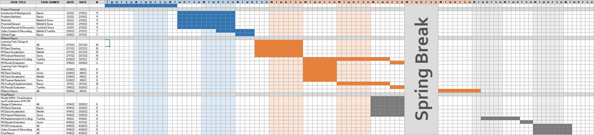

# Project Proposal
## Table of Contents
  - [Introduction](#introduction)
  - [Problem Definition](#problem-definition)
  - [Datasets](#datasets)
  - [Methods](#methods)
  - [Potential Results and Discussion](#potential-results-and-discussion)
  - [Proposed Timeline](#proposed-timeline)
  - [References](#references)

## Introduction
These days, we often hear the response “I listen to everything except country” when asked about a favorite genre of music. We are currently witnessing the rise of “genre-less music fans” [[1]](#references), as online streaming services have greatly widened listeners’ tastes in music [[2]](#references). Exploring new genres is also beneficial, as research has shown that different genres have different abilities to provide relaxation, motivation, joy, and a stronger sense of self [[3]](#references). Many successful music recommendation systems are based on song genre [[4]](#references), but recommendations based on social features [[5]](#references) and lyrics [[6]](#references) have been shown to perform just as well as audio-based recommendations. With an increase in listeners of many genres, does a recommendation system focused mainly on audio truly reflect the listeners’ interests?  

## Problem Definition
We propose an approach where we use features that aren't strongly correlated to genre to predict music for users; this may include features such as lyrics and artist hotness. We call these features *genreless features*. With the increase in genreless music fans and the benefits of exploring new genres, we propose two models to assist in creating a song recommendation system:
1.	Classify the genre of the input song
2.	Recommend a new song with similar genreless features from a different genre

In completing these two goals, we can still provide a relevant recommendation while fostering the exploration of new genres.

## Datasets
We plan to use the Million Song Dataset for our supervised task of genre prediction, and we plan to use the Million Song Dataset in conjunction with the Tagtraum Genre Annotations and musiXmatch Dataset for our unsupervised task of genreless feature clustering.

- [Million Song Dataset (MSD)](http://millionsongdataset.com/)
  - Contains song titles, artists, artist hotness, danceability, loudness, etc.
- [Tagtraum Genre Annotations](https://www.tagtraum.com/msd_genre_datasets.html) (directly associated with MSD)
  - Contains genre labels for songs in MSD
  - Can be correlated with data from MSD using mapping of song IDs
- [musiXmatch Dataset](http://millionsongdataset.com/musixmatch/) (directly associated with MSD)
  - Contains lyrics in bag-of-words format for songs in MSD 
  - Can be correlated with data from MSD using mapping of song IDs

## Methods
Here are the methods we are considering:
- Supervised Learning: Genre Classification [[7]](#references)
  - K-Nearest Neighbors
  - Support Vector Machines
  - Neural Network
  - Logistic Regression
  - Naive Bayes classifier
- Unsupervised Learning: Recommendation from Song Genreless Feature Clustering
  - K-Means
  - Hierarchical Clustering
  - DBSCAN
  - GMM

## Potential Results and Discussion
For the task of genre classification, we expect to build a classifier that performs relatively well given the well-defined nature of the problem. We expect especially good results classifying songs of mainstream genres such as pop, rock, and rap.  

On the other hand, we suspect that the task of genreless feature clustering will have multiple possible results. One potential result is that the clusters end up looking much like the genre classifications, as artists may connect genre and non-genre features to strengthen their messages. Any outliers may then offer insight into potential hybrid genres or perhaps could illustrate what factors make a song “genre-defying.” Another potential result is the opposite of this case, where the feature clusters have no apparent relationship to genres. This would provide interesting insights into how a diversity of themes is shared across all musical genres.

## Proposed Timeline
Our proposed timeline for this project is illustrated in the following Gantt chart:
<!--  -->

## Presentation Video
Here is a brief 3 minute video of the project, explaining our proposal.

   <iframe width="1205" height="753" src="https://www.youtube.com/embed/yi6-surkLE0" title="YouTube video player" frameborder="0" allow="accelerometer; autoplay; clipboard-write; encrypted-media; gyroscope; picture-in-picture" allowfullscreen></iframe>

## References
[1] J. Kristensen, “The rise of the genre-less music fan,” RSS, 22-Mar-2021. [Online]. Available: https://www.audiencerepublic.com/blog/the-rise-of-the-genre-less-music-fan. [Accessed: 21-Feb-2022].

[2] H. Datta, G. Knox, and B. J. Bronnenberg, “Changing their tune: How consumers’ adoption of online streaming affects music consumption and discovery,” Marketing Science, vol. 37, no. 1, pp. 5–21, 2018.

[3] E. Canty, “The effect different genres of music can have on your mind, body, and community.,” Upworthy, 02-Feb-2022. [Online]. Available: https://www.upworthy.com/the-effect-different-genres-of-music-can-have-on-your-mind-body-and-community. [Accessed: 21-Feb-2022].

[4] Adiyansjah, A. A. Gunawan, and D. Suhartono, “Music recommender system based on genre using convolutional recurrent neural networks,” Procedia Computer Science, vol. 157, pp. 99–109, 2019.

[5] K. Benzi, V. Kalofolias, X. Bresson, and P. Vandergheynst, “Song recommendation with non-negative matrix factorization and graph total variation,” 2016 IEEE International Conference on Acoustics, Speech and Signal Processing (ICASSP), 2016.

[6] M. Vystrčilová and L. Peška, “Lyrics or audio for music recommendation?,” Proceedings of the 10th International Conference on Web Intelligence, Mining and Semantics, 2020. 

[7] S. Rawat, “Music genre classification using machine learning,” Analytics Steps. [Online]. Available: https://www.analyticssteps.com/blogs/music-genre-classification-using-machine-learning. [Accessed: 21-Feb-2022].
