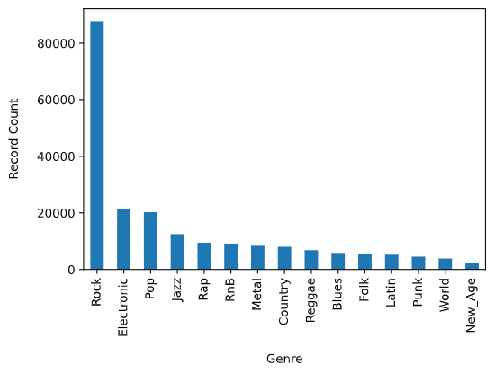

# Midterm Report
## Introduction
These days, we often hear the response “I listen to everything except country” when asked about a favorite genre of music. We are currently witnessing the rise of “genre-less music fans” [[1]](#references), as online streaming services have greatly widened listeners’ tastes in music [[2]](#references). Exploring new genres is also beneficial, as research has shown that different genres have different abilities to provide relaxation, motivation, joy, and a stronger sense of self [[3]](#references). Many successful music recommendation systems are based on song genre [[4]](#references), but recommendations based on social features [[5]](#references) and lyrics [[6]](#references) have been shown to perform just as well as audio-based recommendations. With an increase in listeners of many genres, does a recommendation system focused mainly on audio truly reflect the listeners’ interests?  

## Problem Definition
We propose an approach where we use features that aren't strongly correlated to genre to predict music for users; this may include features such as lyrics and artist hotness. We call these features *genreless features*. With the increase in genreless music fans and the benefits of exploring new genres, we propose two models to assist in creating a song recommendation system:
1.	Classify the genre of the input song
2.	Recommend a new song with similar genreless features from a different genre

In completing these two goals, we can still provide a relevant recommendation while fostering the exploration of new genres.

## Dataset Collection
We first collected all 1,000,000 track IDs and song IDs from the [Million Song Dataset](http://millionsongdataset.com/) track_metadata.db file. From there, we were able to find the genre labels for 280,831 of these songs by using the [tagtraum annotation for the Million Song Dataset](https://www.tagtraum.com/msd_genre_datasets.html). We then removed the songs from our dataset that did not contain genre labels. 

To get the features for each song, we utilized the [Spotify API](https://developer.spotify.com/documentation/web-api/). First, we had to find the Spotify IDs that corresponded to the track IDs and song IDs that we collected from the Million Song Dataset. We were able to do this using [Acoustic Brainz Lab's Million Song Dataset Echo Nest mapping archive](https://labs.acousticbrainz.org/million-song-dataset-echonest-archive/). We were able to find corresponding Spotify IDs for 210,475 of our 280,831 datapoints. We then removed the songs which did not have a corresponding Spotify ID. 

Once we had the Spotify IDs for each song in our dataset, we were able to use the Spotify API to [retrieve the audio features](https://developer.spotify.com/documentation/web-api/reference/#/operations/get-audio-features) pertaining to each of our 210,475 songs. These features include:
- danceability
- energy
- key
- loudness
- mode
- speechiness
- acousticness
- instrumentalness
- liveness
- valence
- tempo
- duration_ms
- time_signature

## Dataset Exploration
The following bar chart shows the distribution of genres in our dataset. We noticed that there is an overwhelming number of datapoints with the Rock genre label, with nearly 42% of the songs labeled in this category. We kept this is mind as we trained our models to ensure the models were not simply learning that most songs are Rock songs.

## Supervised Methods, Results, and Discussion

| Classifier    | Accuracy |
| ----------- | ----------- |
| Logistic Regression Classifier (Original)      | 0.465       |
| Logistic Regression Classifier (Balanced)   | 0.304        |
| Decision Tree Classifier (Original)   | 0.314        |
| Decision Tree Classifier (Balanced)   | 0.205        |
| Neural Network Classifier | TBD |

  
 
### Logistic Regression Classifier
#### _Original Dataset_
Using a Logistic Regression classifier, we were able to achieve 46% accuracy for classifying songs in each of the 13 genre classes. The following figure is a normalized confusion matrix for our Logistic Regression classifier. 

We noticed that rather than having high values along the diagonal, as we would have liked, we had a rather high number of songs being classified as Rock regardless of the true genre. As mentioned in our Dataset Exploration section, our dataset is heavily skewed towards Rock songs. Thus, our normalized confusion matrix for the Logistic Regression classifier shows that most songs were classified as Rock songs. 

#### _Balanced Dataset_
To remedy the issue above, we balanced our dataset by finding the lowest genre count, which was 2,141 songs in the New Age genre, and using only that many songs from each genre; in doing so, we ensured an equal number of songs in each genre label. The resulting dataset had 2,141 songs for each of the 13 genres, so it had a total of 27,833 datapoints. 

Using a Logistic Regression classifier with the balanced dataset, we were able to achieve 30% accuracy for classifying songs in each of the 13 genre classes. Notice that the accuracy of our Logistic Regression classifier went down from 46% to 30%. Despite this loss, we believe our new results are better, as the initial 46% accuracy may have been largely due to the fact that the classifier predicted that most songs were Rock songs and ended up being fairly accurate since an overwhelming proportion of the songs were in fact Rock songs. Even with the lower accuracy, our model still performs better than guessing genre at random, which would be roughly 1/13 = 7% accuracy. The following figure is a normalized confusion matrix for our Logistic Regression classifier with the balanced dataset.

Notice that now, the values on the diagonal are much higher, signifying the model predicting the correct genre more often. Additionally, we are able to gain insights into which genres pairs that the model has trouble distinguishing. For example, the model has learned of similarities between the genre pairs Reggae/Rap, Metal/Punk, and Rock/Punk; these results are promising, as all three pairs of genres often have a large amount of musical overlap.

### Decision Tree Classifier
#### _Original Dataset_
Using a Decision Tree classifier, we were able to achieve 31% accuracy for classifying songs in each of the 13 genre classes. The following figure is a normalized confusion matrix for our Decision Tree classifier. 

We noticed that rather than having high values along the diagonal, as we would have liked, we had a rather high number of songs being classified as Rock regardless of the true genre. As mentioned in our Dataset Exploration section, our dataset is heavily skewed towards Rock songs. Thus, our normalized confusion matrix for the Decision Tree classifier also classifies most songs as Rock songs. 

#### _Balanced Dataset_
As with the Logistic Regression classifier, we tried running the model again after balancing our dataset. Using a Decision Tree classifier with the balanced dataset, we were able to achieve 20% accuracy for classifying songs in each of the 13 genre classes. Again, notice that the accuracy of our Decision Tree classifier has gone down from 31% to 20%. Similar to Logistic Regression, we believe the results from the Decision Tree classifier are largely due to the fact that the classifier predicted most songs were Rock songs and ended up being correct since an overwhelming proportion of the songs were Rock songs. The following figure is a normalized confusion matrix for our Decision Tree classifier with the balanced dataset. 

Notice that now, the values on the diagonal are much higher, signifying the model predicting the correct genre more often. Additionally, we are able to gain insights into which genres pairs that the model has trouble distinguishing. For example, the model has learned of similarities between the genre pairs Metal/Punk, Rock/Punk, and Country/Folk; these results are promising, as all three pairs of genres often have a large amount of musical overlap.

## References
[1] J. Kristensen, “The rise of the genre-less music fan,” RSS, 22-Mar-2021. [Online]. Available: https://www.audiencerepublic.com/blog/the-rise-of-the-genre-less-music-fan. [Accessed: 21-Feb-2022].

[2] H. Datta, G. Knox, and B. J. Bronnenberg, “Changing their tune: How consumers’ adoption of online streaming affects music consumption and discovery,” Marketing Science, vol. 37, no. 1, pp. 5–21, 2018.

[3] E. Canty, “The effect different genres of music can have on your mind, body, and community.,” Upworthy, 02-Feb-2022. [Online]. Available: https://www.upworthy.com/the-effect-different-genres-of-music-can-have-on-your-mind-body-and-community. [Accessed: 21-Feb-2022].

[4] Adiyansjah, A. A. Gunawan, and D. Suhartono, “Music recommender system based on genre using convolutional recurrent neural networks,” Procedia Computer Science, vol. 157, pp. 99–109, 2019.

[5] K. Benzi, V. Kalofolias, X. Bresson, and P. Vandergheynst, “Song recommendation with non-negative matrix factorization and graph total variation,” 2016 IEEE International Conference on Acoustics, Speech and Signal Processing (ICASSP), 2016.

[6] M. Vystrčilová and L. Peška, “Lyrics or audio for music recommendation?,” Proceedings of the 10th International Conference on Web Intelligence, Mining and Semantics, 2020. 

[7] S. Rawat, “Music genre classification using machine learning,” Analytics Steps. [Online]. Available: https://www.analyticssteps.com/blogs/music-genre-classification-using-machine-learning. [Accessed: 21-Feb-2022].
