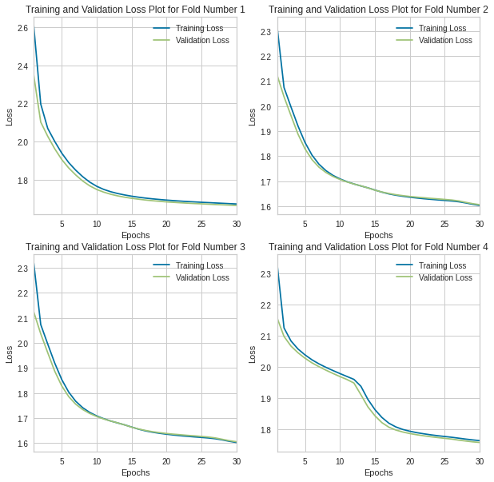
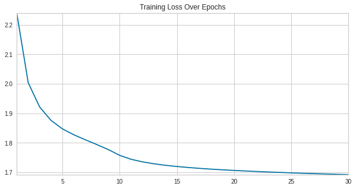

# Midterm Report
## Introduction
These days, we often hear the response “I listen to everything except country” when asked about a favorite genre of music. We are currently witnessing the rise of “genre-less music fans” [[1]](#references), as online streaming services have greatly widened listeners’ tastes in music [[2]](#references). Exploring new genres is also beneficial, as research has shown that different genres have different abilities to provide relaxation, motivation, joy, and a stronger sense of self [[3]](#references). Many successful music recommendation systems are based on song genre [[4]](#references), but recommendations based on social features [[5]](#references) and lyrics [[6]](#references) have been shown to perform just as well as audio-based recommendations. With an increase in listeners of many genres, does a recommendation system focused mainly on audio truly reflect the listeners’ interests?  

## Problem Definition
We propose an approach where we use features that aren't strongly correlated to genre to predict music for users; this may include features such as lyrics and artist hotness. We call these features *genreless features*. With the increase in genreless music fans and the benefits of exploring new genres, we propose two models to assist in creating a song recommendation system:
1.	Classify the genre of the input song
2.	Recommend a new song with similar genreless features from a different genre

In completing these two goals, we can still provide a relevant recommendation while fostering the exploration of new genres.

## Dataset Collection
We first collected all 1,000,000 track IDs and song IDs from the [Million Song Dataset](http://millionsongdataset.com/) track_metadata.db file. From there, we were able to find the genre labels for 280,831 of these songs by using the [tagtraum annotation for the Million Song Dataset](https://www.tagtraum.com/msd_genre_datasets.html). We then removed the songs from our dataset that did not contain genre labels. 

To get the features for each song, we utilized the [Spotify API](https://developer.spotify.com/documentation/web-api/). First, we had to find the Spotify IDs that corresponded to the track IDs and song IDs that we collected from the Million Song Dataset. We were able to do this using [Acoustic Brainz Lab's Million Song Dataset Echo Nest mapping archive](https://labs.acousticbrainz.org/million-song-dataset-echonest-archive/). We were able to find corresponding Spotify IDs for 210,475 of our 280,831 datapoints. We then removed the songs which did not have a corresponding Spotify ID. 

Once we had the Spotify IDs for each song in our dataset, we were able to use the Spotify API to [retrieve the audio features](https://developer.spotify.com/documentation/web-api/reference/#/operations/get-audio-features) pertaining to each of our 210,475 songs. These features include:
- danceability
- energy
- key
- loudness
- mode
- speechiness
- acousticness
- instrumentalness
- liveness
- valence
- tempo
- duration_ms
- time_signature

## Dataset Exploration

### Distribution of Genres

 
As determined from our review of existing works on the MSD dataset and the associated Tagraum dataset, there is a high degree of data imbalance that we will need to adress for our models. We will explore metrics measuring model "goodness" that takes this into account (metrics such as accuracy may not be a good behavior of a model exploring deeper relationships in the data. There are 15 unique categories that we have as genre labels with about 42% comprising of the category "Rock". After the collection of our data, we retained 168,379 datapoints to train our models - losing points if not having an associated genre in the Tagraum dataset or if not having a mapping from MSD Track ID to Spotify ID. The statistics presented throughout our exploration stage is on the 80 percent of data we use for training and cross validating (not the 20 percent held out for evaluation across models.

### Feature Historgams

 
From the various historgrams, we can see initial need for data preprossing given the differences in ranges of values from feature to feature and difference in overall distributions. 
### Feature Correlation Heat Map

 
The above image explores the correlation between the features in our dataset. Intuitively we can see some of these relationships. For instance, accousticness which describes songs with less electric amplication is negativelely correlated with loudness and energy. Similarly we can see how valance (how "happy" a song is) and danceability is positively correlated as is loudness and energy.
### Features by Genre (Danceability and Speechiness)

 

 
The above image shows how early in our data exploration process, we see different features having different predictability capabilities (forms in its distribution by genre that can provide useful information). We can additionally see again our data is inherently skewed towards the genre "Rock." Finding to subsample datapoints of class Rock in our dataset is a method we hope to explore as we way to mitigate this issue.

Included below are scatter plots of some of the audio features vs the genre label.

    " alt="Duration vs. Genre">
    " alt="Key vs. Genre">
    " alt="Loudness vs. Genre">
    " alt="Tempo vs. Genre">
    " alt="Time Signature vs. Genre">

## PCA and Dimensionality Reduction

The original dataset that we created using information from Spotify had 13 features as explained previously. All the columns/attributes were considered as features except the columns containing song/track ids and the genre column, which we used as our label. Since this was a large dataset with several features, we used Principal Component Analysis (PCA) to reduce the dimensionality of the dataset which would potentially make it easier to work with. We chose a threshold of 0.95 for the explained variance ratio to keep only the most important features. This helped us get a transformed dataset with 8 components.

## Supervised Methods, Results, and Discussion

| Classifier    | Accuracy |
| ----------- | ----------- |
| Logistic Regression Classifier (Original)      | 0.465       |
| Logistic Regression Classifier (Balanced)   | 0.304        |
| Decision Tree Classifier (Original)   | 0.314        |
| Decision Tree Classifier (Balanced)   | 0.205        |
| Neural Network Classifier | 0.492        |

  
 
### Logistic Regression Classifier
#### _Original Dataset_
Using a Logistic Regression classifier, we were able to achieve 46% accuracy for classifying songs in each of the 13 genre classes. The following figure is a normalized confusion matrix for our Logistic Regression classifier. 

We noticed that rather than having high values along the diagonal, as we would have liked, we had a rather high number of songs being classified as Rock regardless of the true genre. As mentioned in our Dataset Exploration section, our dataset is heavily skewed towards Rock songs. Thus, our normalized confusion matrix for the Logistic Regression classifier shows that most songs were classified as Rock songs. 

#### _Balanced Dataset_
To remedy the issue above, we balanced our dataset by finding the lowest genre count, which was 2,141 songs in the New Age genre, and using only that many songs from each genre; in doing so, we ensured an equal number of songs in each genre label. The resulting dataset had 2,141 songs for each of the 13 genres, so it had a total of 27,833 datapoints. 

Using a Logistic Regression classifier with the balanced dataset, we were able to achieve 30% accuracy for classifying songs in each of the 13 genre classes. Notice that the accuracy of our Logistic Regression classifier went down from 46% to 30%. Despite this loss, we believe our new results are better, as the initial 46% accuracy may have been largely due to the fact that the classifier predicted that most songs were Rock songs and ended up being fairly accurate since an overwhelming proportion of the songs were in fact Rock songs. Even with the lower accuracy, our model still performs better than guessing genre at random, which would be roughly 1/13 = 7% accuracy. The following figure is a normalized confusion matrix for our Logistic Regression classifier with the balanced dataset.

Notice that now, the values on the diagonal are much higher, signifying the model predicting the correct genre more often. Additionally, we are able to gain insights into which genres pairs that the model has trouble distinguishing. For example, the model has learned of similarities between the genre pairs Reggae/Rap, Metal/Punk, and Rock/Punk; these results are promising, as all three pairs of genres often have a large amount of musical overlap.

### Decision Tree Classifier
#### _Original Dataset_
Using a Decision Tree classifier, we were able to achieve 31% accuracy for classifying songs in each of the 13 genre classes. The following figure is a normalized confusion matrix for our Decision Tree classifier. 

We noticed that rather than having high values along the diagonal, as we would have liked, we had a rather high number of songs being classified as Rock regardless of the true genre. As mentioned in our Dataset Exploration section, our dataset is heavily skewed towards Rock songs. Thus, our normalized confusion matrix for the Decision Tree classifier also classifies most songs as Rock songs. 

#### _Balanced Dataset_
As with the Logistic Regression classifier, we tried running the model again after balancing our dataset. Using a Decision Tree classifier with the balanced dataset, we were able to achieve 20% accuracy for classifying songs in each of the 13 genre classes. Again, notice that the accuracy of our Decision Tree classifier has gone down from 31% to 20%. Similar to Logistic Regression, we believe the results from the Decision Tree classifier are largely due to the fact that the classifier predicted most songs were Rock songs and ended up being correct since an overwhelming proportion of the songs were Rock songs. The following figure is a normalized confusion matrix for our Decision Tree classifier with the balanced dataset. 

Notice that now, the values on the diagonal are much higher, signifying the model predicting the correct genre more often. Additionally, we are able to gain insights into which genres pairs that the model has trouble distinguishing. For example, the model has learned of similarities between the genre pairs Metal/Punk, Rock/Punk, and Country/Folk; these results are promising, as all three pairs of genres often have a large amount of musical overlap.

### Neural Network
#### Results and Discussion
Another model which was saw as one that could have potential success was Neural Network model. We began with a transformation of our features and labels. For our features we utilized sklearn.preprocessing.PowerTransformer with zero mean, unit standard deviation. While Box-Cox and Yeo-Johnson are used for transforming features towards a multivariate normal distribution, we used Yeo-johnson due to its receptiveness of negative valued features. The preprocessing of labels consisted of encoding them into integers.

We began the exploration of this model type by having a simplistic structure to the network, a single hidden layer and an output layer of size number of classes with ReLU units being our activation function of choice throughout. The loss function we utilized was Cross Entropy Loss, but look in phase two for Loss functions that may perhaps be more helpful for the imbalanced data. To optimize our parameters we used SGD with a learning rate of 0.00005 and momentum value of 0.9. We trained over a span of 30 epochs. Although we plan to refine the model further in our second phase, we began the initial stages of model selection using K-Fold Cross Validation with the number of folds being used 4 and choosing models with the lowest average loss across folds. Additionally to see that our proposed models were not overfitting, we plotted the training and validation loss over multiple epochs.

 

After tuning our parameters using the mentioned method, we then trained our chosen model and trained the model over the entire dataset. To provide as a sanity check that our model was in fact learning, we again plotted our loss curve and found the final training loss using Cross Entropy Loss of our model to be 1.76698.

 

For model selection as suggested we simply used the resulting loss value but this plans to be adjusted in our second phase. Additionally, for evaluation metrics to compare with success of other models, we simply use accuracy for now, although definately being altered in the near future (especially given the nature of our dataset, accuracy will not hold as an all-encompassing metric). Nonetheless, we can report for now that our model classifies the correct genre with accuracy 49.1982%. In comparison, a naive approach of predicting all genres as "Rock," would provide an accuracy of 40%. While showing some success in learning relationsihps between our features, the our model undoubtedly has the need of tweaking (Loss Function, Hyperparameters {learning_rate, momentum, etc.), Network Architecture, etc.). In comprasion wtih the other methods, we will work on finding more appropriate forms of metrics that can be used for comparison as well as forms of preprocessing that can address our imbalanced dataset (subsampling of our dominante subCategory, further feature engineering, feature reduction, etc.)

## Unsupervised Task Exploration. 
The [MusixMatch Dataset](http://millionsongdataset.com/musixmatch/) contained song lyrics in a bag of words format. We analyzed songs that were located both in the dataset and the song_features.csv file. From there, a dictionary was created, with the word and word count listed for each track_id. Below is an illustration:

The dictionary contained 93,355 unique track_ids. From there, three random songs from our dictionary were chosen. Then, we compared the percent overlap between the unique words contained in the random song and those from another song in the dictionary. (Note that we only consider the individual words themselves, not their frequency of occurrence in the songs.) Percent overlap is calculated by comparing the number of shared words over the number of words documented in the random song. For example, if the two songs had six words in common and the random song had a total of ten unique words, then the percent overlap would be 60%, or 0.6. 

We then decided to compare percent overlap values between songs that belong to the same/a different genre as/than the random song.  Here are our results below: 

## Challenges faced
The dataset is heavily skewed towards rock songs, which are the overwhelming majority of data points in the dataset. This makes it difficult to accurately predict the genre of a song and we had to perform standardization of the dataset to make it more accurate. However, the sheer number of rock songs in the dataset still represents a challenge for analysis.
 
## Plans for Part 2 of the project
 
In the next part, we will be building a recommendation model that takes a song as input and outputs a list of songs that are similar to the input song. We intend this process to be genre agnostic and our work in part 1 proved that the features we have chosen are not genre specific. This is why our models do not classify genre very well. But this also means that we can use the entire dataset (with dimensionality reduction) to train our recommendation model. Some of the planned improvements include:
 
- Improving the neural network model by finetuning hyperparameters.
- Implementing a lyrics-based approach using the bag-of-words model, as explained below.

### Lyrics-Based Approach 

A future direction to pursue is to consider applying natural language processing models to our bags of words. As mentioned earlier in the report, we calculated similarity between songs using percent overlap. Since our objective is to find songs with overlap in lyrics, we can ignore songs from the dictionary that have little to no percent overlap. The downside to this metric of course is that the word count does not influence the percent overlap calculation. Two songs can for example contain similar sets of unique words, but may not be similar at all in terms of word count across this commonality. 

The other issue is that even if we find songs with a high percent overlap with the common words and there are similar word count values across, we do not know the order in which the words appear in each of the respective songs. 

A possible solution is to examine natural language processing techniques where the order of the words does not matter. We could use some kind of n-gram methods for example (i.e. like skip-gram, syntactic n-grams, etc). [[8]](#references)

## References
[1] J. Kristensen, “The rise of the genre-less music fan,” RSS, 22-Mar-2021. [Online]. Available: https://www.audiencerepublic.com/blog/the-rise-of-the-genre-less-music-fan. [Accessed: 21-Feb-2022].

[2] H. Datta, G. Knox, and B. J. Bronnenberg, “Changing their tune: How consumers’ adoption of online streaming affects music consumption and discovery,” Marketing Science, vol. 37, no. 1, pp. 5–21, 2018.

[3] E. Canty, “The effect different genres of music can have on your mind, body, and community.,” Upworthy, 02-Feb-2022. [Online]. Available: https://www.upworthy.com/the-effect-different-genres-of-music-can-have-on-your-mind-body-and-community. [Accessed: 21-Feb-2022].

[4] Adiyansjah, A. A. Gunawan, and D. Suhartono, “Music recommender system based on genre using convolutional recurrent neural networks,” Procedia Computer Science, vol. 157, pp. 99–109, 2019.

[5] K. Benzi, V. Kalofolias, X. Bresson, and P. Vandergheynst, “Song recommendation with non-negative matrix factorization and graph total variation,” 2016 IEEE International Conference on Acoustics, Speech and Signal Processing (ICASSP), 2016.

[6] M. Vystrčilová and L. Peška, “Lyrics or audio for music recommendation?,” Proceedings of the 10th International Conference on Web Intelligence, Mining and Semantics, 2020. 

[7] S. Rawat, “Music genre classification using machine learning,” Analytics Steps. [Online]. Available: https://www.analyticssteps.com/blogs/music-genre-classification-using-machine-learning. [Accessed: 21-Feb-2022].

[8] D. Jurafsky and J.H. Martin, "N-gram Language Models," Stanford University. [Online]. Available: https://web.stanford.edu/~jurafsky/slp3/3.pdf. [Accessed: 04-April-2022].
